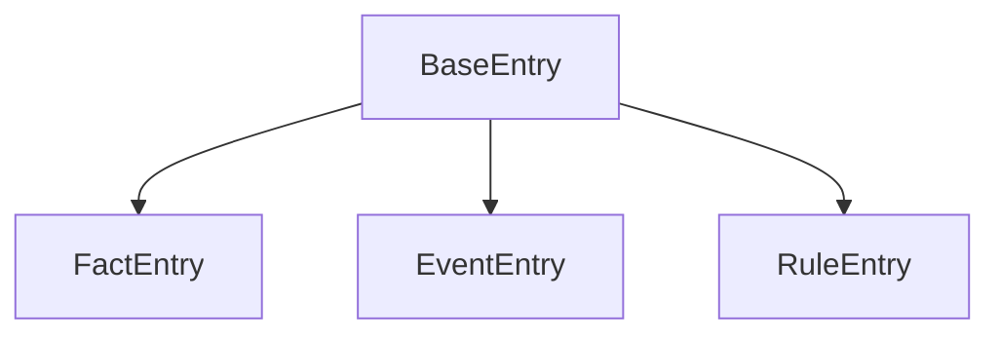

---
tags:
- '[AI - Driven Dynamic Dialogue through Fuzzy Pattern Matching|dynamic dialogues'
- '[Pasted image 20230508174951.png'
---

YT Video from Aarthificial

<iframe src="https://www.youtube.com/embed/1LlF5p5Od6A?list=PLh0j6fxciWbLLRtBC4dvn0TWEgHxDkWww" height="113" width="200" allowfullscreen="" allow="fullscreen" style="aspect-ratio: 1.76991 / 1; width: 100%; height: 100%;"></iframe>

## Showcase
The Architect in Astortion reacts to stuff like ignoring him, jumping, falling down. Multiple stuff. Based on a GDC talk by Elan Ruskin on [[AI - Driven Dynamic Dialogue through Fuzzy Pattern Matching|dynamic dialogues]]. 

## Working

At the heart of typewriter, lies its database, a collection of tables with a scriptable objects with entries. An entry is just an object with id.

But there are 3 types of entries with a specific purpose:

- **Fact Entry**: Store and retrieve a piece of info represented by an integer. 
	- Each Fact Entry has a **Scope** corresponding to his save system.
		  1. The *Global* Scope is saved globally same with *Area* and *Scene* Scopes. Also a *Temporary* Scope.
-  **Rule Entry:** Basic block of dialogue,![[Pasted image 20230508174951.png]]
	- 